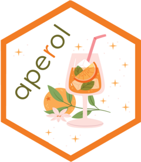

<!-- README.md is generated from README.Rmd. Please edit that file -->

```{r, include = FALSE}
knitr::opts_chunk$set(
  collapse = TRUE,
  comment = "#>",
  fig.path = "man/figures/README-",
  out.width = "100%"
)
```

# aperol 

A joke package, based on [this](https://fosstodon.org/@kellybodwin/112769186345818866) mastodon thread, started by Kelly Bodwin and Shannon Pileggi, and specifically the replies by [Nick Tierney](https://aus.social/@njtierney/112770398923583882) and [Ella Kaye](https://fosstodon.org/@ellakaye/112771757956362352).


<!-- badges: start -->
<!-- badges: end -->

**aperol** gives you praise, but as if from someone tipsy or drunk. Specifically, it generates some praise using the [praise](https://github.com/rladies/praise) package and garbles it. `aperol::tipsy()` swaps a subset of words, and `aperol::drunk()` mixes up the whole affirmation, repeating some words along the way.

## Installation

You can install the development version of aperol from [GitHub](https://github.com/) with:

``` r
# install.packages("remotes")
remotes::install_github("EllaKaye/aperol")
```

## Examples

```{r example}
library(aperol)
tipsy()
tipsy(2, "${Exclamation}! ${EXCLAMATION}!-${EXCLAMATION}! This is just ${adjective}!")
drunk()
drunk(2, 3, "You are ${creating} a ${adverb} ${adjective} ${rpackage}")
```

## The hex

The hex for the package (created by Kelly Bodwin) is so good that here it is in its full-sized glory.

